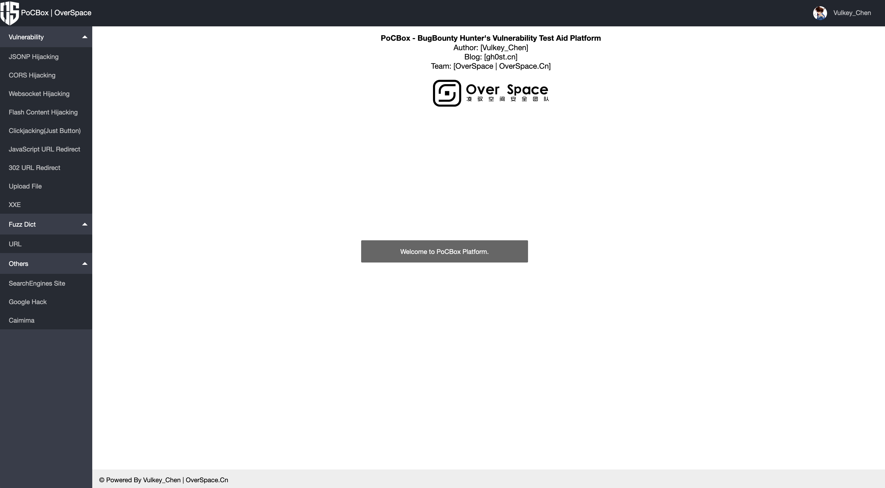

# PoCBox - 漏洞测试验证辅助平台

开发这个平台的初衷是帮助自己在漏洞挖掘测试中更加方便快捷的辅助自己进行漏洞验证。

一开始的想法是框架化、模块化，但是开发着开发着就发现有点累，于是采用了原始的方法去开发：原生JavaScript+PHP。

**PoCBox功能：** 生成漏洞验证代码（便于撰写报告）、在线测试（便于快速手工测试）

> 作者：Vulkey_Chen 博客：gh0st.cn
>
> 团队：米斯特安全团队 Www.Hi-OurLife.Com
>
> 注意：平台不关注安全漏洞问题，也建议各位搭建的时候选好服务和域名！！！

## PoCBox 版本更迭

关于PoCBox的版本更迭记录如下。

### PoCBox V1 Beta

1. 增加漏洞模块（JSONP劫持、CORS跨域资源读取、Flash跨域资源读取）
2. 平台使用原生JS+PHP开发搭建

### PoCBox V2 Beta

1. 增加Fuzz类模块（URL）
2. 增加其他类模块（Google Hack、Caimima）
3. 平台由原生JS转向jQuery

### PoCBox V2.0.1 Beta

1. 修复JSONP劫持无法在线测试的问题（感谢：dogboy）
2. 修复交互类攻击PoC的目标带有&符号无法正常在线测试（将URL地址进行URL编码再传输 感谢：Vulkey_Chen）
3. 增加漏洞测试模块：点击劫持（按钮）、JavaScript URL跳转、302 URL跳转

## PoCBox 开源

开发出来不少时间了，也内测了一段时间，现在放出开源版本，如下图所示：

**搭建平台所需环境：** PHP

**开源功能：**

- 测试：JSONP劫持、CORS、Flash跨域资源读取、Google Hack语法生成、URL测试字典生成、JavaScript URL跳转、302 URL跳转
- 中英文语言切换（默认为英文）

**结合DoraBox靶场演示测试**

Youtube：<https://youtu.be/1Q5Q_8gObwU>

开源地址：https://github.com/gh0stkey/PoCBox

## 最后

感谢米斯特安全所有核心成员的协助内测。祝各位新年快乐！
